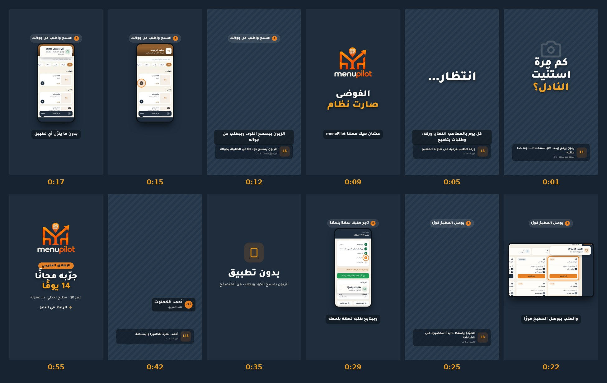

# فيديو الإطلاق التجريبي — خطة التصوير

**المواصفات:** فيديو عمودي 9:16 (1080×1920)، مدته **58 ثانية**، للريلز وتيك توك والستوري. الكلام مكتوب على الشاشة كترجمة، لأن أغلب الناس بيتفرجوا بدون صوت.

**الفكرة بسطر:** «كم مرة استنيت النادل؟» ← المشكلة ← menuPilot ← الطلب من الطاولة للمطبخ ← ثلاث ميزات ← الفريق ← جرّبه مجانًا.

**المعاينة:** `animatic.mp4` هي نسخة أولية كاملة من الفيديو (أرسلتها في المحادثة).
- **اللقطات الرمادية المخططة** هي اللي إنتو بتصوروها. على كل وحدة كود اللقطة ومدتها على الشاشة.
- **الباقي جاهز:** الرسوميات، وشاشات النظام، والترجمة.

## السكربت

| الوقت | المشهد | على الشاشة | الصوت |
|---|---|---|---|
| 0:00–0:03 | **الخطّاف** — زبون يرفع إيده وما حدا منتبه (L1) | «كم مرة استنّيت النادل؟» | الزبون: «لو سمحت!» |
| 0:03–0:08 | **المشكلة** — ورقة، مطبخ، ساعة (L2، L3، L4) | «ورقة…»، «انتظار…»، «طلب ضايع» | VO: «كل يوم بالمطاعم: انتظار، ورقة، وطلبات بتضيع» |
| 0:08–0:11 | **التحوّل** — الشعار | «الفوضى صارت نظام» | VO: «عشان هيك عملنا menuPilot» |
| 0:11–0:20 | **امسح واطلب** — الزبون يمسح الكود (L6)، ثم شاشة المنيو والطلب | «1 · امسح واطلب من جوالك» | VO: «الزبون بيمسح الكود، وبيطلب من جواله… بدون ما ينزّل أي تطبيق» |
| 0:20–0:27 | **المطبخ** — شاشة المطبخ ونزول طلب جديد، ثم الطبّاخ يضغط (L8) | «2 · يوصل المطبخ فورًا» | VO: «والطلب بيوصل المطبخ فورًا» + رنّة |
| 0:27–0:34 | **التتبع** — حالة الطلب تتحدّث، ثم النادل يقدّم الطبق (L11) | «3 · تابع طلبك لحظة بلحظة» | VO: «وبيتابع طلبه لحظة بلحظة» |
| 0:34–0:42 | **ثلاث ميزات** | «بدون تطبيق»، «يكمل لو انقطع النت»، «بلا عمولة» | VO: «وحتى لو انقطع النت، الشغل ما بيوقف… وبلا ولا عمولة على أي طلب» |
| 0:42–0:52 | **الفريق** — كل واحد 1.2 ث مع اسمه (L13–L17)، ثم الفريق كامل (L18) | أسماء الفريق وأدوارهم | أحمد للكاميرا: «إحنا فريق menuPilot، والنسخة التجريبية صارت متاحة» |
| 0:52–0:58 | **الختام** | الشعار، «الإطلاق التجريبي»، «جرّبه مجانًا 14 يومًا»، «الرابط في البايو» | VO: «جرّبوه مجانًا 14 يوم… والرابط بالبايو» |

## التعليق الصوتي (VO)

يسجّله أحمد (أو أي حدا من الفريق صوته واضح) **كملف منفصل**، بنبرة هادئة وواثقة، بدون استعجال:

1. «كل يوم بالمطاعم: انتظار، ورقة، وطلبات بتضيع.»
2. «عشان هيك عملنا menuPilot.»
3. «الزبون بيمسح الكود، وبيطلب من جواله… بدون ما ينزّل أي تطبيق.»
4. «والطلب بيوصل المطبخ فورًا.»
5. «وبيتابع طلبه لحظة بلحظة.»
6. «وحتى لو انقطع النت، الشغل ما بيوقف… وبلا ولا عمولة على أي طلب.»
7. «جرّبوه مجانًا 14 يوم… والرابط بالبايو.»

**طريقة التسجيل:**
- غرفة هادئة فيها أثاث، مثل الكنب والستائر، لأنها بتمتص الصدى.
- الجوال على بعد شبر من الفم.
- كل جملة 3 مرات، وثانيتين سكوت بين كل جملة والثانية.
- جملة الفريق «إحنا فريق menuPilot…» تنصوّر مع اللقطة L18، مش مع التعليق.

## قائمة اللقطات

اللقطة بتطلع على الشاشة ثانية أو ثانيتين بس، لكن صوّروا كل وحدة **6–10 ثواني**: ثانيتين قبل الحركة، وثانيتين بعدها، و**3 محاولات** على الأقل.

| الكود | اللقطة | الحجم والزاوية | على الشاشة |
|---|---|---|---|
| **L1** | زبون قاعد على الطاولة يرفع إيده: «لو سمحت!»، يطّلع حواليه، وما حدا منتبه | متوسطة، من الجنب | 3 ث |
| **L2** | إيد النادل تكتب الطلب على دفتر ورق بسرعة | قريبة على الإيد | 1.6 ث |
| **L3** | ورقة طلب مكرمشة على طاولة المطبخ، وإيد بتدوّر عليها | قريبة | 1.6 ث |
| **L4** | الزبون يطّلع على الساعة أو يطقطق بأصابعه على الطاولة | قريبة | 1.8 ث |
| L5 | ستاند الـ QR على الطاولة، ثابت (لقطة احتياطية) | قريبة جدًا | — |
| **L6** | الزبون يقرّب جواله من ستاند الـ QR ويمسح الكود | من فوق الكتف | 2.5 ث |
| L7 | إبهام الزبون يضغط على الجوال (لقطة احتياطية) | قريبة جدًا | — |
| **L8** | الطبّاخ يطّلع على الشاشة، ويضغط «ابدأ التحضير» بثقة | جانبية، الوجه والإيد واضحين | 3.5 ث |
| L9 | تحضير الأكل: تقطيع، صبّ، ترتيب الطبق (لقطة احتياطية) | قريبة | — |
| L10 | الزبون يطّلع على جواله ويبتسم (لقطة احتياطية) | قريبة | — |
| **L11** | النادل يحط الطبق قدّام الزبون، والزبون مبسوط | متوسطة | 3.5 ث |
| L12 | صاحب المطعم أو الكاشير يطّلع على اللابتوب ويهز راسه برضا (لقطة احتياطية) | متوسطة | — |
| **L13** | أحمد: يرفع راسه للكاميرا ويبتسم | قريبة، نفس الخلفية للكل | 1.2 ث |
| **L14** | علي: نفس الحركة | قريبة | 1.2 ث |
| **L15** | عمار: نفس الحركة | قريبة | 1.2 ث |
| **L16** | سجى: نفس الحركة | قريبة | 1.2 ث |
| **L17** | رنين: نفس الحركة | قريبة | 1.2 ث |
| **L18** | الفريق كامل واقف مع بعض، وأحمد يحكي: «إحنا فريق menuPilot، والنسخة التجريبية صارت متاحة» | متوسطة واسعة، والكل بالكادر | 4 ث |
| صوت | 10 ثواني سكوت بالمطعم (room tone)، بدون ما حدا يحكي | — | — |

اللقطات **بالخط العريض** أساسية. الباقي احتياطي بيساعدني بالمونتاج.

## قبل التصوير

- [ ] **المكان:**
  - مطعم أو مقهى بإذن صاحبه.
  - وقت هادئ، قبل الذروة.
  - ضوء نهار من الشباك.
- [ ] **الناس:**
  - زبون (ممكن صديق)، ونادل، وطبّاخ، والفريق الخمسة.
  - اللبس سادة ومتناسق، بدون شعارات تجارية.
  - **موافقة كل شخص بيظهر.**
- [ ] **ستاند QR على الطاولة.** بصمّمه بهوية menuPilot إذا بعتولي رابط الموقع.
- [ ] **جوال الزبون** مفتوح على منيو المطعم التجريبي: من الموقع، «جرّبه» ثم «جرّب كزبون».
- [ ] **لابتوب أو تابلت للمطبخ** مفتوح على شاشة المطبخ التجريبية («جرّب شاشة المطبخ»).
- [ ] **دفتر طلبات ورق وقلم** لمشهد المشكلة، وطبق أكل شكله حلو.
- [ ] **حامل جوال (ترايبود)**، ومايك لاصق إذا متوفر، ومنديل للعدسة، وشاحن.

## إعدادات التصوير

- **عمودي دايمًا (9:16)**، وكل اللقطات بنفس السرعة **30fps**، بدقة 1080p أو 4K.
- **ثبّتوا التعريض والتركيز:** اضغط مطوّلًا على الشاشة لحتى يطلع AE/AF Lock.
- **الضوء** من قدّام أو من الجنب. لا تصوّروا حدا ظهره للشباك.
- **منطقة الأمان:** خلّوا الوجوه والأشياء المهمة بنص الكادر، لأن أعلى 15% وأسفل 25% بتغطيهم واجهة الريلز.
- **لا تستعملوا الزوم الرقمي.** قرّبوا إنتو من الشي اللي بتصوروه.
- **الشاشات:** خلّوها مضيئة ومفتوحة على النظام الحقيقي عشان المشهد يكون صادق. التفاصيل بتطلع واضحة لأني بركّب لقطات الشاشة الأصلية فوقها.
- **الصوت في L1 وL18:** الجوال قريب، والمكان هادئ، وبدون موسيقى بالخلفية.

## كيف تبعتولي اللقطات

- **الملفات الأصلية.** لا تبعتوها عن طريق واتساب لأنه بيضغطها ويخرّب الجودة.
- **سمّوا كل ملف بكود اللقطة:** `L06_take2.mp4`، والتعليق الصوتي `VO_take1.m4a`.
- **طريقة الإرسال:**
  - ارفعوها هون بالمحادثة مباشرة.
  - أو ابعتوا رابط Google Drive. بس لازم تسمحوا للبيئة توصل لـ `drive.google.com` و`drive.usercontent.google.com`، من إعدادات الشبكة: *Network access ← Allowed domains*.
- **الموسيقى:** اختاروا مقطوعة مسموح استعمالها مجانًا (مثل YouTube Audio Library أو Pixabay Music)، إيقاعها متفائل وطاقتها متوسطة، وابعتوها.

## شو بعمل بعد ما توصلني اللقطات

1. بختار أفضل محاولة لكل لقطة، وبقصّها على توقيت السكربت.
2. بصحّح الألوان لتطلع دافئة ومتناسقة مع هوية menuPilot.
3. بركّب الرسوميات وشاشات النظام والترجمة. نفس الملف اللي طلّع المعاينة بيطلّع الطبقة الرسومية بخلفية شفافة (`render.js --mode overlay`).
4. **الصوت:** بنظّف التعليق، وبوازن الموسيقى، وبضيف المؤثرات (رنّة الطلب، النقرات).
5. **التسليم:**
   - MP4 عمودي 1080×1920.
   - صورة غلاف للريلز.
   - نسخة قصيرة 15 ثانية للستوري.

## بحتاج منكم

- **رابط الموقع** اللي بدكم يبين على ستاند الـ QR، وإذا بدكم بآخر الفيديو كمان.
- **اسم المطعم** اللي بتصوروا فيه، إذا بدكم نشكره بآخر الفيديو.
- **موعد النشر.**

## الملفات

| الملف | ما هو |
|---|---|
| `source/launch.html` | الفيديو كله كخط زمني واحد: المشاهد والرسوميات والترجمة |
| `source/render.js` | بيحوّل الخط الزمني لفيديو (`node render.js`) أو لطبقة شفافة (`--mode overlay`) |
| `storyboard.jpg` | لوحة القصة: لقطة من كل مشهد |
